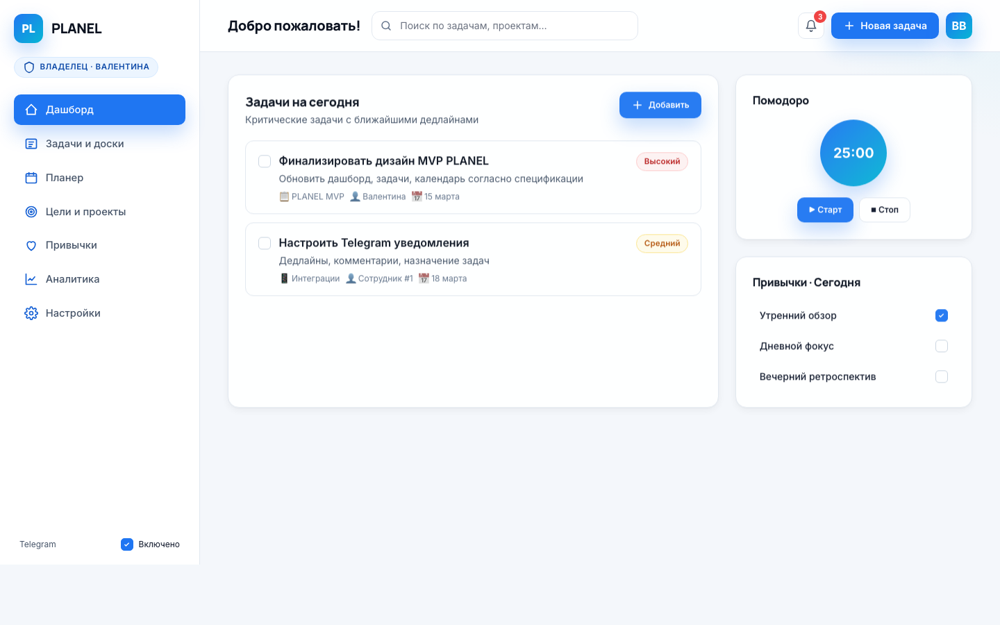
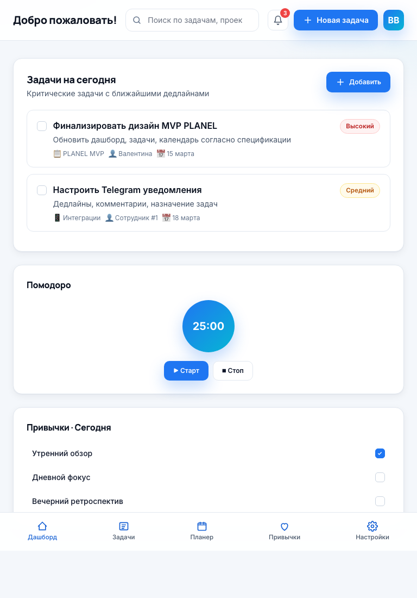
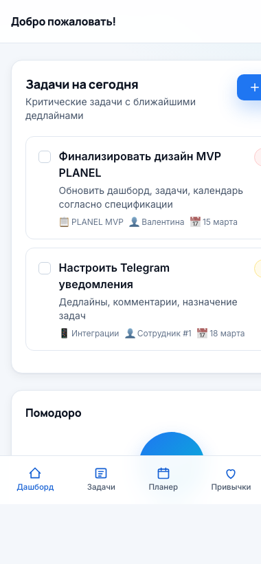
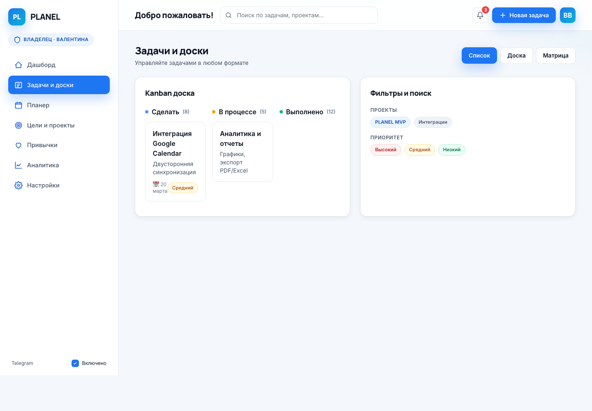
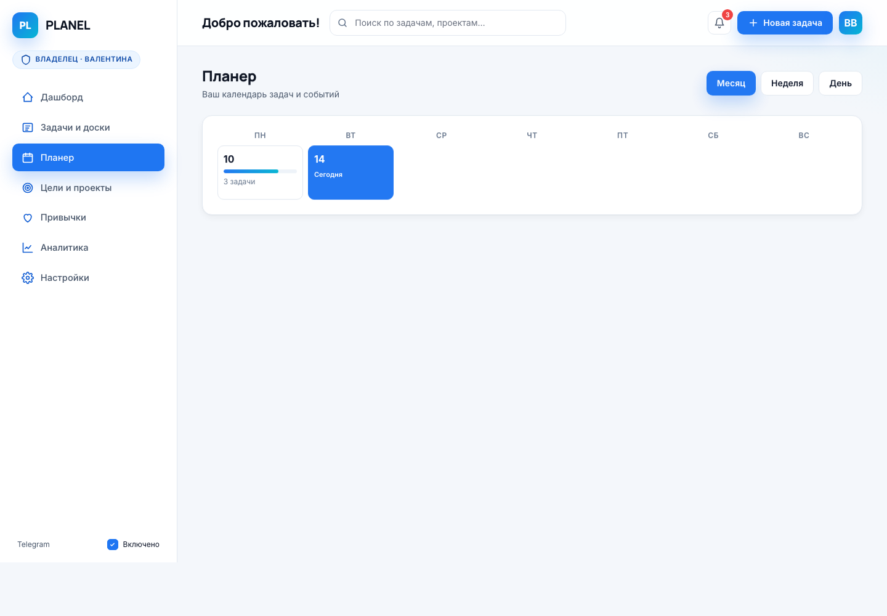
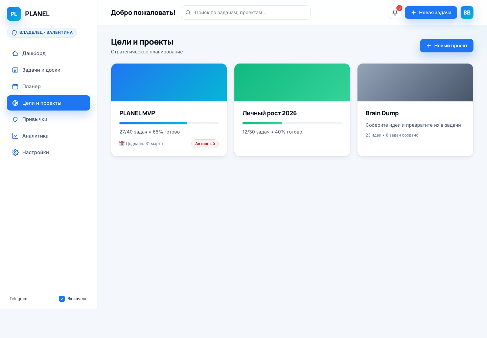
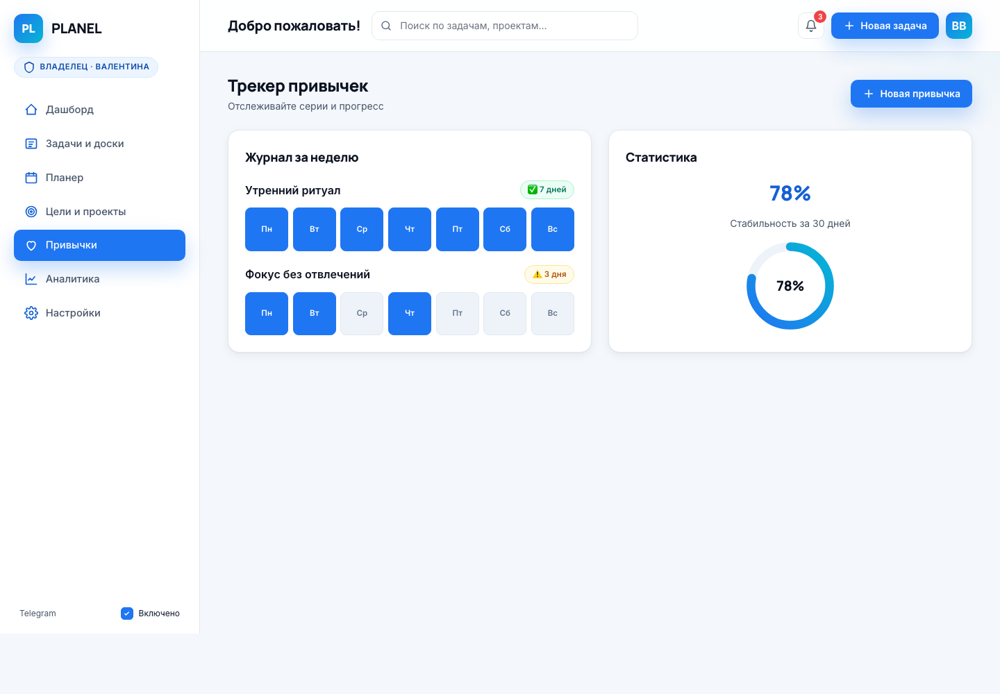
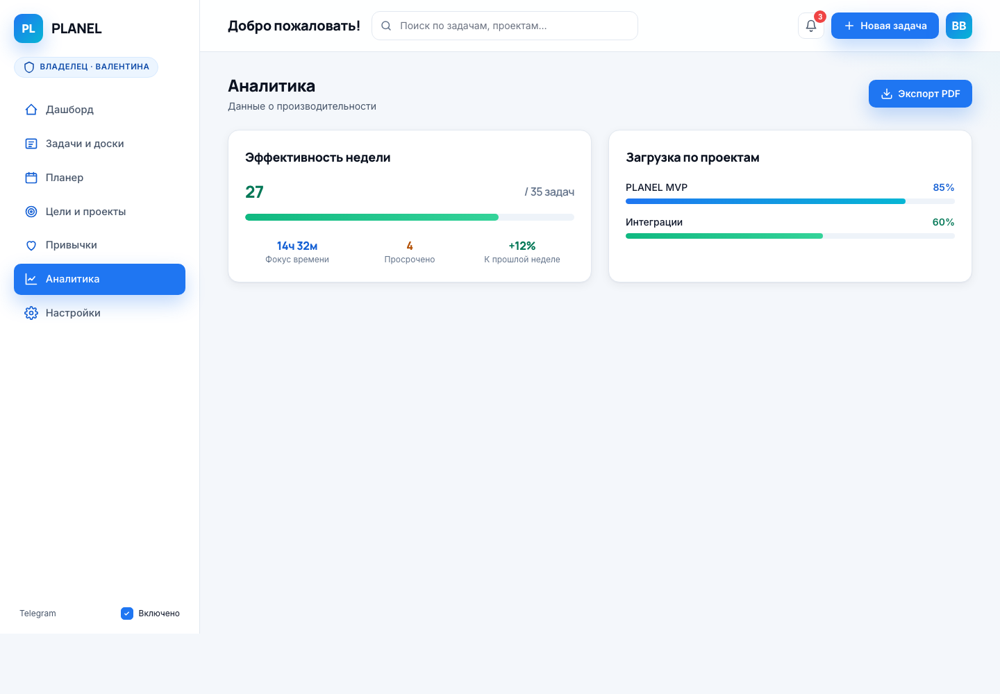
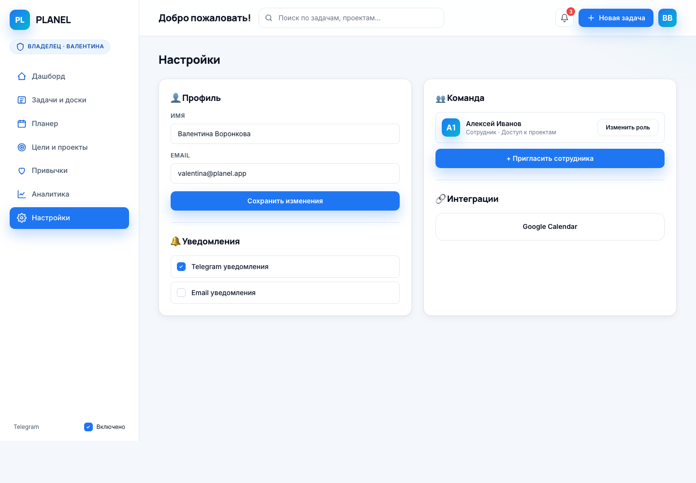

# PLANEL

Веб-приложение для планирования: задачи, цели, привычки, аналитика, дневник и командная работа — в одном месте.

## О проекте

PLANEL — это full-stack планировщик: фронтенд-SPA без сборки на ванильном JS плюс Node.js/Express бэкенд с Supabase. Единый HTML-файл приложения содержит всю клиентскую логику и кастомную дизайн-систему. Подходит и как прототип для UX-итераций, и как рабочий сервис: есть авторизация, Google Calendar, Telegram-бот, команды и офлайн-хранение данных.

### Разделы приложения

- **Сегодня** — список задач на день, помодоро-таймер, блок XP-геймификации, привычки дня
- **Дашборд** — агрегированный обзор, серии, еженедельная активность
- **Задачи и доски** — список, Kanban (3 статуса), матрица Эйзенхауэра, фильтры по приоритету и проекту, подзадачи, повторы (ежедневно / будни / еженедельно / ежемесячно), свайп на мобильном
- **Планер** — календарь день/неделя/месяц, Google Calendar интеграция (бета), двусторонняя синхронизация, авто-план
- **Цели и проекты** — проекты с цветовой маркировкой, декомпозиция на задачи, прогресс-бары
- **Привычки** — недельный и месячный журнал, серии, недельные / месячные цели, связывание с целями из 100
- **Колесо баланса** — 7 сфер жизни, радарная диаграмма, авто-построение по фактической активности задач и привычек
- **Дневник питания** — записи по приёмам, калории / макро / вода, графики за 7 дней
- **100 целей на год** — SMART-цели с шаблонами, импорт/экспорт CSV, привязка к проекту
- **Дневник** — 3 режима: эмоции (настроение / энергия / сон), рефлексия дня, дневник благодарности
- **Заметки** — маркдаун, теги, поиск, soft-delete через корзину
- **Награды** — уровни, XP, ачивки
- **Команда** — приглашения сотрудников, роли (Владелец / Ставить задачи / Просмотр), рабочие пространства
- **Корзина** — soft-delete для всех типов сущностей с восстановлением
- **Профиль** — email / пароль, Google Calendar, Telegram-бот, управление командой

### Интеграции

- **Google Calendar (бета)** — OAuth, пулл событий в планер, пуш задач как событий
- **Telegram-бот** — утренние/дневные/вечерние напоминания, тестовое сообщение, расписание
- **Админ-панель** — метрики пользователей, рассылка уведомлений (для владельца)

## Технологии

**Фронтенд**
- HTML5 + ванильный JavaScript (SPA-навигация без роутера и фреймворка)
- [Tailwind CSS](https://tailwindcss.com/) через CDN + кастомная CSS-система
- Google Fonts: `Inter` (UI), `Manrope` (заголовки)
- SVG-иконки inline, без внешних библиотек
- `localStorage` для клиентского состояния (настройки, колесо баланса, дневники, привычки, цели)
- Service Worker (`sw.js`) + PWA-манифест (`manifest.webmanifest`)

**Бэкенд**
- Node.js (>=18), Express
- Supabase (auth + БД задач, пользователей, команд, токенов интеграций)
- Отдельные route-модули под `api/` (auth, admin, google, team, telegram, tasks)
- Dockerfile для деплоя

## Дизайн-система

- **Палитра:** сине-голубая (`#1F76F2` — основной бренд, `#06B6D4` — поддерживающий cyan)
- **Темы:** светлая и тёмная; переключение в левом меню (десктоп) и в шапке (мобильный)
- **Контраст:** все тексты соответствуют WCAG AA
- **Сетка:** 8/12-колоночная, отступы кратны 4 px
- **Адаптив:** проверено на 375 (мобильный) / 768 (планшет) / 1280+ (десктоп). Мобильная навигация — нижняя, десктоп — левый сайдбар

## Структура

```
PLANEL/
├── api/                    # Express route-модули
│   ├── auth/               # регистрация, логин, подтверждение email
│   ├── admin/              # метрики и пользователи
│   ├── google/             # OAuth и Calendar API
│   ├── team/               # приглашения, члены, рабочие пространства
│   ├── telegram/           # бот, токены, расписание
│   └── tasks.js            # CRUD задач
├── src/
│   ├── index.html          # лендинг
│   ├── app.html            # всё приложение (SPA)
│   ├── tests.html          # клиентские self-тесты
│   ├── privacy.html        # политика конфиденциальности
│   ├── terms.html          # оферта
│   ├── icon.svg
│   ├── manifest.webmanifest
│   └── sw.js               # Service Worker
├── docs/
│   └── screenshots/
├── server.js               # Express-сервер + раздача статики
├── package.json
├── Dockerfile
└── README.md
```

## Запуск

### Локально

```bash
npm install
npm run dev     # hot-reload (node --watch server.js)
# или
npm start       # node server.js
```

Сервис поднимется на `http://localhost:3000` (лендинг) и `http://localhost:3000/app` (приложение).

### Переменные окружения

Приложение читает из `process.env`:

- `SUPABASE_URL`, `SUPABASE_ANON_KEY`, `SUPABASE_SERVICE_ROLE_KEY` — для auth и БД
- `GOOGLE_CLIENT_ID`, `GOOGLE_CLIENT_SECRET`, `GOOGLE_REDIRECT_URI` — для Google Calendar
- `TELEGRAM_BOT_TOKEN` — для Telegram-уведомлений

### Docker

```bash
docker build -t planel .
docker run -p 3000:3000 --env-file .env planel
```

## Тесты

Клиентские self-тесты на ванильном JS (без фреймворка) проверяют ключевую логику: дата/время, серии привычек, аналитика, матрица Эйзенхауэра, CSV, markdown-парсер, поиск, рекуррентные задачи, XP / уровни / ачивки, Google Calendar sync-маппинг, декомпозиция целей, авто-планирование, колесо баланса по активности, дневник благодарности, переключение режимов дневника и др.

Запуск: открыть `http://localhost:3000/tests` в браузере. Все тесты выполняются в текущем окне с изолированным `localStorage`-префиксом `test_planel_`. На момент последней проверки — **165 тестов, все проходят**.

## Скриншоты

### Дашборд



### Адаптив

| Планшет (768) | Мобильный (380) |
|---|---|
|  |  |

### Задачи и доски



### Планер



### Цели и проекты



### Привычки



### Аналитика



### Настройки


